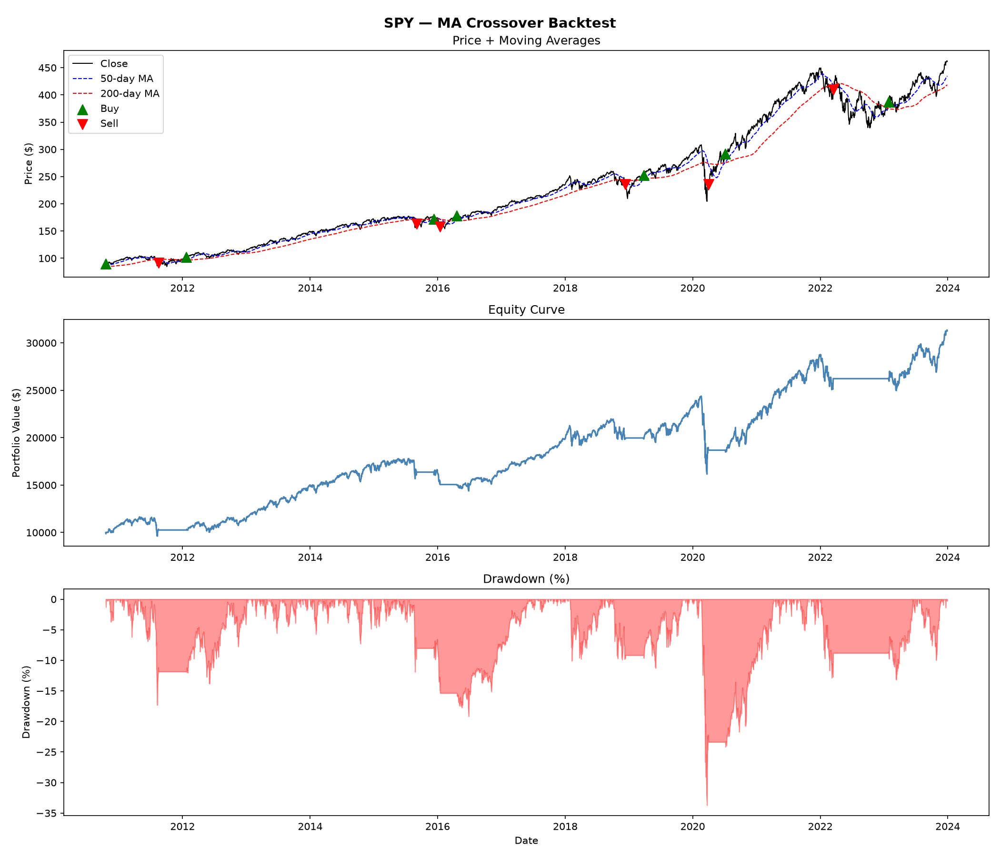
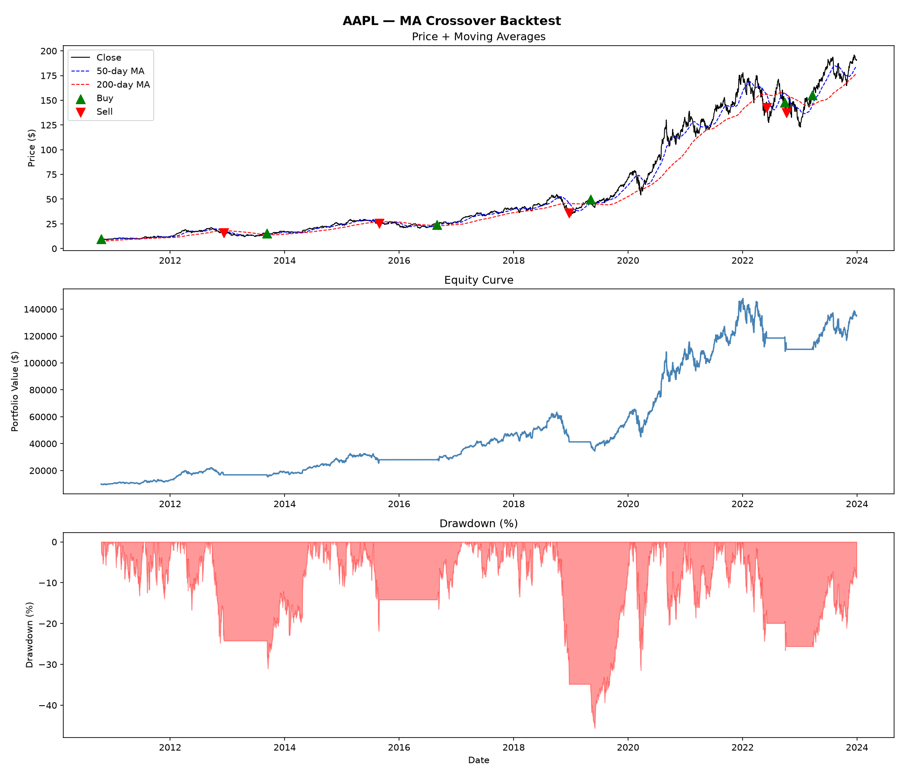
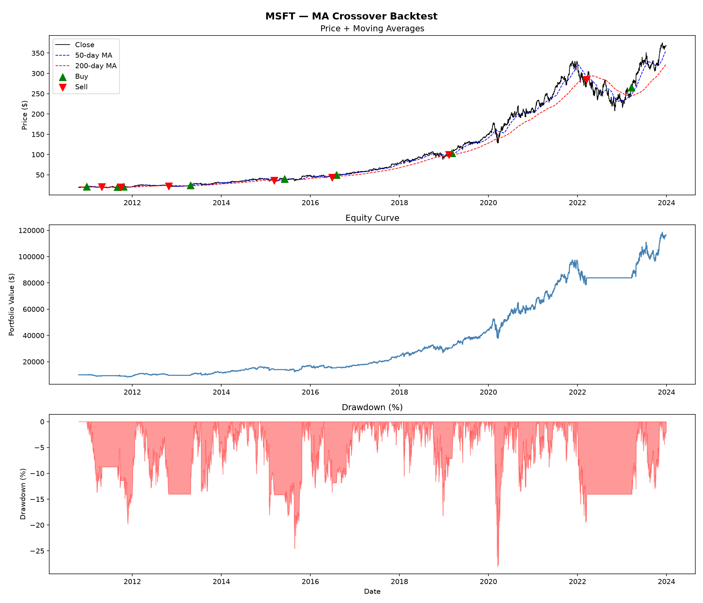

# Algorithmic Trading Backtesting Engine

A custom-built backtesting engine in Python that tests a moving average crossover strategy on historical stock price data. Built from scratch without backtesting libraries.

## Strategy

**Golden Cross / Death Cross (50/200-day MA crossover)**
- Buy when the 50-day MA crosses above the 200-day MA
- Sell when it crosses back below
- Fully invested or fully out — no partial positions

## Results

| Ticker | Total Return | CAGR | Sharpe Ratio | Max Drawdown | Trades | Win Rate |
|--------|-------------|------|--------------|--------------|--------|----------|
| SPY    | 212.71%     | 9.03% | 0.68        | -33.72%      | 7      | 66.67%   |
| AAPL   | 1248.92%    | 21.81% | 0.93       | -45.61%      | 6      | 80.00%   |
| MSFT   | 1065.15%    | 20.47% | 0.93       | -28.04%      | 8      | 71.43%   |

*Backtest period: Jan 2010 – Jan 2024. Initial capital: $10,000.*

## Charts

### SPY


### AAPL


### MSFT


## Project Structure
algo-backtest/
├── src/
│ ├── data.py # yfinance data fetching
│ ├── strategy.py # MA crossover signal generation
│ ├── backtester.py # portfolio simulation engine
│ ├── metrics.py # performance metrics
│ └── visualisation.py # chart generation
├── results/ # output charts
├── main.py # entry point
├── requirements.txt
└── README.md

## Setup

```bash
pip install -r requirements.txt
python main.py
```

## Limitations

- **No transaction costs** — real trades incur commission and slippage
- **Survivorship bias** — AAPL and MSFT were chosen knowing they performed well; a live strategy wouldn't have that hindsight
- **Look-ahead bias** — none introduced, but the backtest period overlaps with one of the strongest bull markets in history
- **Single position sizing** — always 100% in or out; real strategies use position sizing
- **No risk management** — no stop-losses or position limits

## Tech Stack

Python · pandas · numpy · matplotlib · yfinance
